# dr-house-hospital
A decentralized hospital management system using microservices.
# Dr. House Hospital - Exercise Series

## 🌟 Overview
The **Dr. House Hospital** series is a set of decentralized web applications designed for simplified patient management within a hospital. The system follows a **microservice architecture**, where different web applications handle distinct functionalities and communicate with each other to accomplish the main goal.

---

## 🏗 Architecture
The system consists of the following **microservices**:

```mermaid
flowchart TD;
    A[👤 Patient] -->|Registers| B[📌 Admission]
    B -->|Sends ID| C[🩺 Diagnoses]
    C -->|Provides Diagnosis| D[💊 Treatments]
    D -->|Issues Treatment| E[📑 Accountancy]
    E -->|Generates Invoice| F[🏥 Administration]
```



1. **Admission** - Assigns a unique identifier to each patient and forwards it to the Diagnosis service.
2. **Diagnoses** - Determines the patient's diagnosis based on symptoms and forwards it to the Treatments service.
3. **Treatments** - Provides the appropriate treatment and forwards it to the Accountancy service.
4. **Accountancy** - Generates invoices for hospital services provided to the patient.
5. **Administration** - Offers a user interface for admitting patients and managing invoices.

---

## 🎨 Technologies Used
The project incorporates several backend development topics, including:

- 🏗 **Microservices Architecture**
- ⚙️ **Bean Injection**
- 📂 **Property Files**
- 🌐 **Web Communication**
- 🗃 **NoSQL Databases**
- 🗄 **SQL Databases**
- 🔐 **Security Best Practices**

---

## 🚀 Getting Started
### Prerequisites
Ensure you have the following installed:
- ☕ **Java (JDK 17+ recommended)**
- 🏗 **Spring Boot**
- 🐳 **Docker (if using containerization)**
- 🗄 **PostgreSQL / MongoDB (for SQL and NoSQL storage)**
- 🔧 **Maven or Gradle**
- 🔗 **Git**

### Setup Instructions
1. Clone the repository:
   ```sh
   git clone https://github.com/YOUR_USERNAME/dr-house-hospital.git
   cd dr-house-hospital
   ```

2. Run each microservice individually:
   ```sh
   mvn spring-boot:run
   ```
   or
   ```sh
   gradle bootRun
   ```

3. Configure the `.env` or `application.properties` files as needed.

4. Access the UI via `http://localhost:8080` (if applicable).

---

## 🤝 Contribution
Feel free to contribute by:
- 📌 Submitting **issues**
- 🔄 Creating **pull requests**
- 💡 Suggesting **enhancements**

---

## 📜 License
This project is licensed under the **MIT License** - see the [LICENSE](LICENSE) file for details.

---

🎉 *Happy Coding! 🚀*
